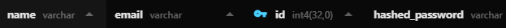
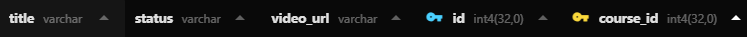
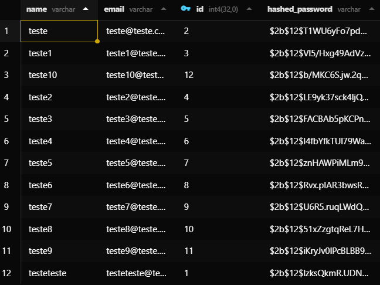
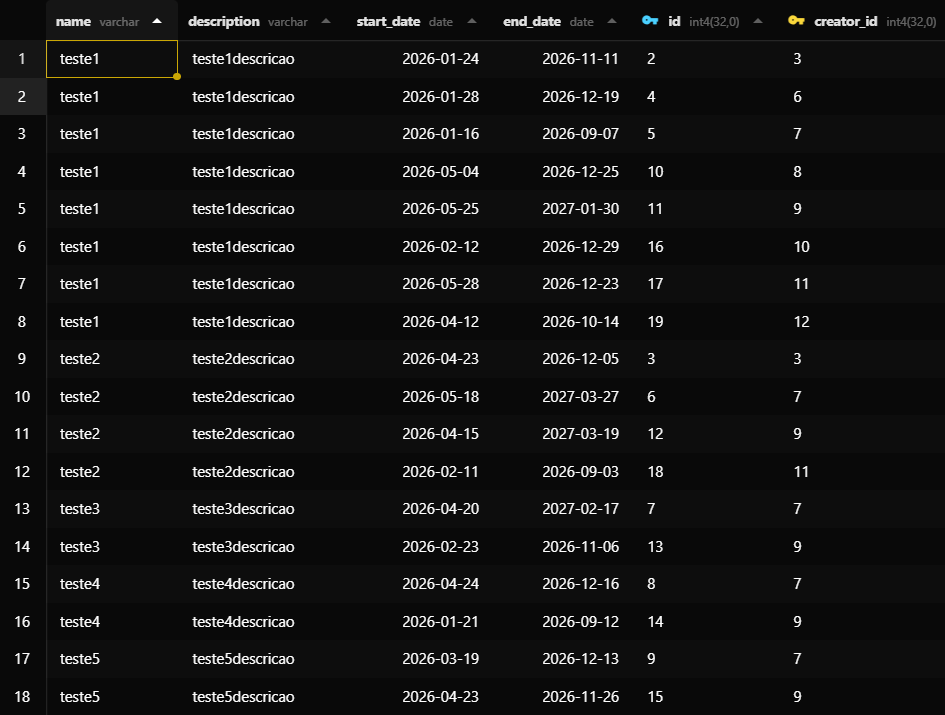
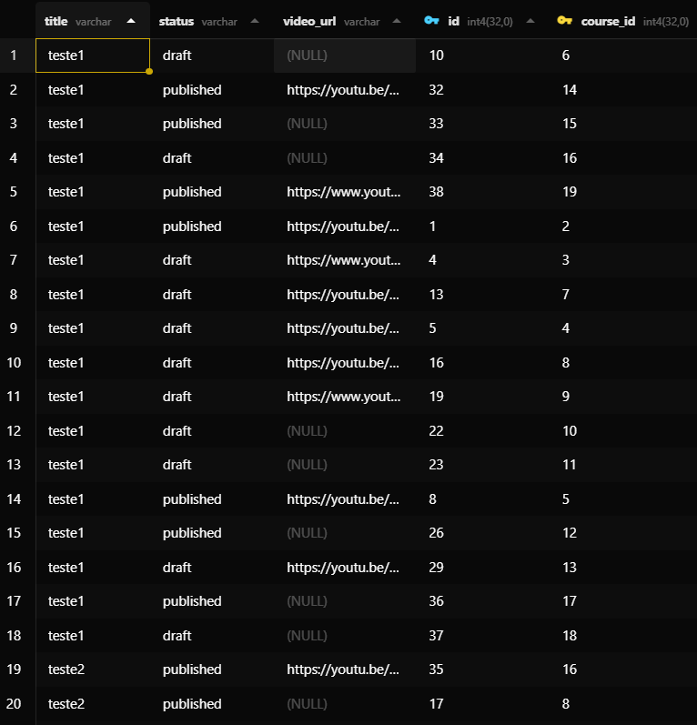

# CourseSphere Full Stack

## 1. Descrição Geral

O **CourseSphere** é uma plataforma colaborativa de gestão de cursos online desenvolvida como solução para um desafio técnico de desenvolvimento full stack. A aplicação permite que utilizadores registados criem, editem e gerenciem cursos e aulas de forma estruturada, seguindo os princípios de uma **API RESTful**. O projeto foca-se na organização de código, integridade de dados através de relacionamentos complexos e uma experiência de utilizador fluida e segura.

## 2. Tecnologias e Ferramentas

A stack tecnológica foi selecionada para garantir escalabilidade, tipagem forte e facilidade de manutenção, cumprindo requisitos avançados de desenvolvimento.

### Backend
* **Python (FastAPI)**: Framework de alta performance para construção da API.
* **SQLModel**: Biblioteca para interação com o banco de dados que combina **SQLAlchemy** e **Pydantic**.
* **PostgreSQL**: Sistema de gestão de banco de dados relacional.
* **JWT (JSON Web Token)**: Implementação de autenticação **stateless** para segurança das rotas.
* **Pytest**: Ferramenta para execução de testes automatizados de modelos e requisições.

### Frontend
* **React (Vite)**: Biblioteca para construção da interface de utilizador com foco em performance.
* **TypeScript**: Adição de tipagem estática para maior segurança no desenvolvimento.
* **Axios**: Cliente HTTP para consumo da **API REST** do backend.
* **Vitest**: Framework de testes unitários e de componentes para o ecossistema Vite.
* **CSS3 (Módulos)**: Estilização organizada por componentes para evitar conflitos de escopo.

### Infraestrutura e DevOps
* **Docker**: Conteinerização de toda a aplicação para garantir paridade entre ambientes.
* **Docker Compose**: Orquestração de serviços múltiplos (banco de dados, backend e frontend).
* **Render**: Plataforma utilizada para o deploy do backend e persistência de dados.
* **Vercel**: Serviço utilizado para o deploy e hospedagem do frontend.

## 3. Funcionalidades Implementadas

O projeto cumpre integralmente os requisitos funcionais mínimos e incorpora diferenciais avançados.

* **Autenticação e Registro**: Sistema completo de criação de conta e login com validações de email único e tamanho mínimo de senha de 6 caracteres. A persistência da sessão é gerida via **JWT**, e rotas privadas são protegidas contra acesso não autorizado.
* **Gestão de Cursos (CRUD)**: Interface para criação, leitura, edição e exclusão de cursos. Foram implementadas regras de negócio estritas onde apenas o criador (**creator_id**) do curso possui permissão para realizar alterações ou exclusões.
* **Gestão de Aulas**: Funcionalidade de **CRUD** para aulas associadas a cada curso. Suporta a definição de status (**draft** ou **published**) e validação de **video_url**. Apenas o dono do curso pode gerir as aulas do mesmo.
* **Eliminação em Cascata**: Implementação de integridade referencial profunda. Ao remover um utilizador, todos os seus cursos e respectivas aulas são removidos automaticamente do banco de dados.
* **Busca e Filtros Avançados**: Implementação de campo de pesquisa por nome de curso, filtro por data de início e funcionalidade de visualização exclusiva de **Meus Cursos**.
* **Integração com API Externa**: Consumo da **RandomUser API** para geração dinâmica de instrutores convidados e alunos fictícios na tela de detalhes. Os dados são mantidos em **sessionStorage** para garantir consistência visual durante a navegação.

---
### Visualização do Banco de Dados (Beekeeper Studio)
>Estrutura das tabelas e relacionamentos (User, Course, Lesson).
> 
> 
> 
---

## 4. Instruções de Instalação e Execução (Via Docker)

O sistema foi configurado para ser executado de forma simplificada através de containers.

**Passo 1**: Clonar o repositório do **GitHub**.
```bash
git clone [https://github.com/usuario/v-lab-desafio-software.git](https://github.com/usuario/v-lab-desafio-software.git)
cd v-lab-desafio-software
```

**Passo 2**: Configurar as variáveis de ambiente. Crie um arquivo **.env** na pasta **backend** seguindo o modelo do **.env.example**, definindo as chaves **DATABASE_URL** e **SECRET_KEY**.

**Passo 3**: Executar a subida dos serviços.
```bash
docker-compose up --build
```

**Portas Padrão**:
* **Backend (FastAPI)**: http://localhost:8000
* **Frontend (Vite)**: http://localhost:5173

## 5. Execução de Testes Automatizados

O projeto utiliza **Docker Profiles** para isolar e executar a suite de testes, garantindo que o ambiente de teste não interfira nos dados de desenvolvimento.

**Testes de Backend (Pytest)**:
```bash
docker-compose --profile test run backend_test
```

**Testes de Frontend (Vitest)**:
```bash
docker-compose --profile test run frontend_test
```

## 6. Dados de Acesso para Teste (Seed)

O banco de dados pode ser populado automaticamente com dados de teste através do script de seeding.

**Comando para Seeding (Via Docker)**:
```bash
docker exec -it coursesphere_backend python -m app.db.seed
```

**Credenciais de Teste Geradas**:
* **Login**: teste1@teste.com | **Senha**: teste1password
* **Login**: teste2@teste.com | **Senha**: teste2password

---
### Visualização de Dados Populados (Beekeeper Studio)
> Tabela de usuários,cursos e lessons preenchida no Beekeeper.
> 
> 
> 
---

## 7. Deploy e Endpoints

A aplicação está disponível publicamente nos seguintes endereços:

* **Frontend (Vercel)**: https://v-lab-desafio-software.vercel.app/
* **API (Render)**: https://coursesphere-backend-xxud.onrender.com
* **Documentação da API (Swagger/OpenAPI)**: https://coursesphere-backend-xxud.onrender.com/docs
